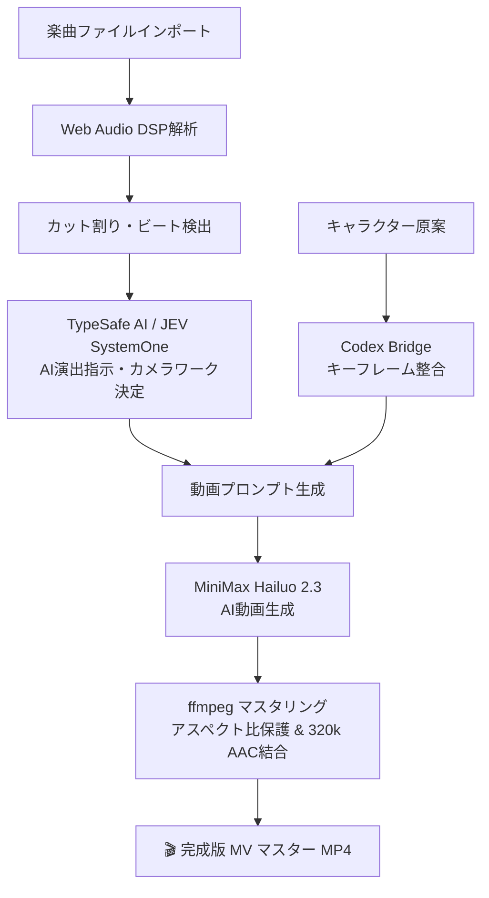

# 🎬 Aithyrion Director (AI Music Video Director)

[](https://www.typescriptlang.org/)
[](https://react.dev/)
[](https://vitejs.dev/)
[](https://tailwindcss.com/)
[](LICENSE)

**Aithyrion Director** は、楽曲のビート・展開・エネルギー遷移をリアルタイム解析し、AIディレクター（TypeSafe JEV SystemOne）と映像生成AI（MiniMax Hailuo / OpenAI Codex / ffmpeg）が協調して**ビート同期フルモーションAIミュージックビデオ**を自動監督・生成する統合ディレクターツールです。

---

## ✨ 主な機能

1. **🎵 オーディオ解析 & 楽曲タイムライン分割 (DSP)**
   - ブラウザの Web Audio API による BPM 検出、オンセット（アタック）、エネルギー変曲点の自動検出
   - 音楽の山場・ドロップ・ビルドアップに応じたシネマティックカット割り（4〜12カット）

2. **🤖 AI ディレクション (TypeSafe AI / JEV SystemOne)**
   - 各ビート・カットごとの演出方針（カメラワーク、構図、被写体、ライティング、感情トーン）を自律判定
   - リアルタイム演出インスペクターでプロンプトとJEVの判断根拠を可視化

3. **🎨 キャラクター原案 & キーフレーム生成 (Codex Bridge)**
   - キャラクター原案（Sara / Lexia など）の参照管理と継続性（Continuity）維持
   - ローカル Codex CLI または API 連携によるカットごとのキーフレーム合成

4. **⚡ AI 動画生成 (MiniMax Hailuo 2.3)**
   - MiniMax Video Generation API による 1080p/768p フルモーション動画生成
   - 全カット一括生成（Batch Generation）による全編自動生成パイプライン

5. **🎬 ビート同期 VJ マスタリング (ffmpeg)**
   - 各カットのアスペクト比・解像度・尺コンフォーミング
   - 縦型素材の上部アンカークロップ（頭部・表情の保護）
   - VJ エフェクト（カラーグレーディング、フラッシュ、フェード）および AAC 320k ビート同期合成

---

## 🏗️ アーキテクチャ



---

## 🚀 クイックスタート

### 必要要件
- **Node.js**: v20 以上
- **ffmpeg**: システムの PATH にインストールされていること
- **API Keys**:
  - [TypeSafe AI (JEV SystemOne)](https://api.typesafe.ai) API キー
  - [MiniMax](https://www.minimax.io/) API キー

### 1. リポジトリのクローン & 依存関係のインストール
```bash
git clone https://github.com/psychodissection-ship-it/aithyrion-director.git
cd aithyrion-director
npm install
```

### 2. 環境変数の設定
```bash
cp .env.example .env
```
`.env` ファイルを開き、APIキーを設定します：
```env
JEV_API_ENDPOINT=https://api.typesafe.ai/v1/systemone
JEV_API_KEY=your_typesafe_jev_api_key
MINIMAX_API_KEY=your_minimax_api_key
```

### 3. 開発サーバーの起動
```bash
npm run dev
```
ブラウザで `http://localhost:5173` を開きます。

### 4. 本番向けスタンドアロンサーバーの起動（オプション）
Docker コンテナや本番環境で独立した API サーバーとして動作させる場合：
```bash
npm run server
```

---

## 🔒 セキュリティ & 安全性設計

- **サーバーサイドプロキシ**: API キーはクライアント（ブラウザ）に一切露出せず、ローカル/バックエンドサーバー側で注入されます。
- **入力サニタイズ**: ファイル名、ジョブID、画像パスのパストラバーサル境界検証を徹底しています。
- **コマンドインジェクション防止**: ffmpeg 呼び出しはシェル展開を無効化した `spawn` 経由で行われます。

---

## 📄 ライセンス

MIT License
